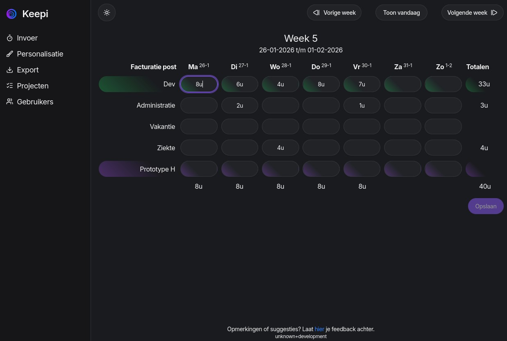
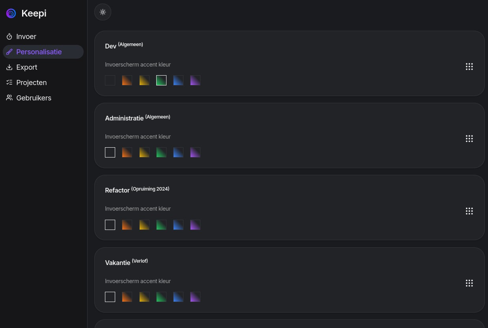
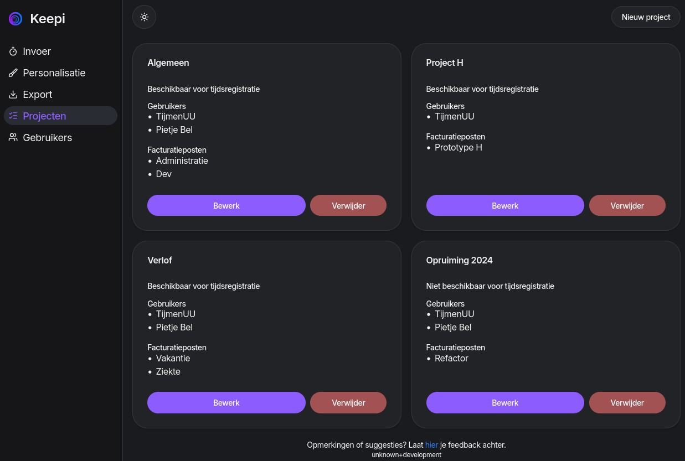
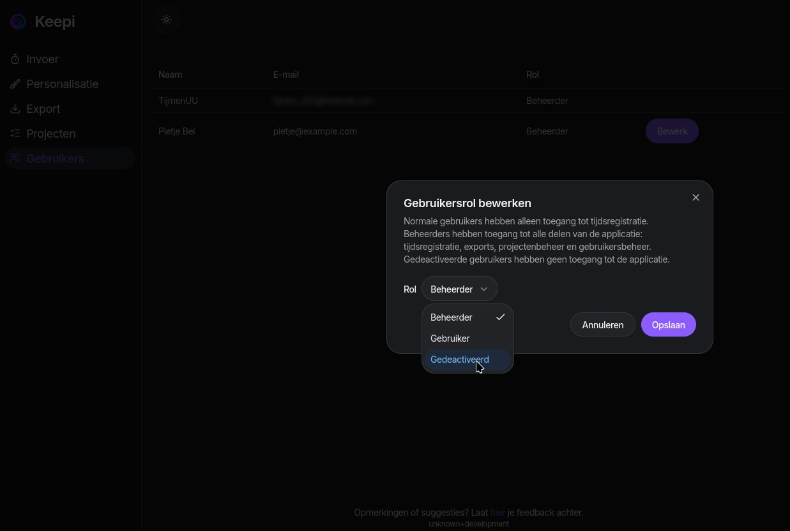
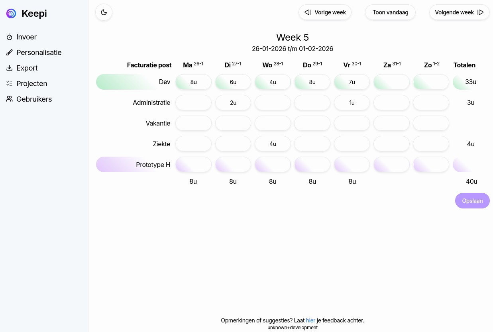
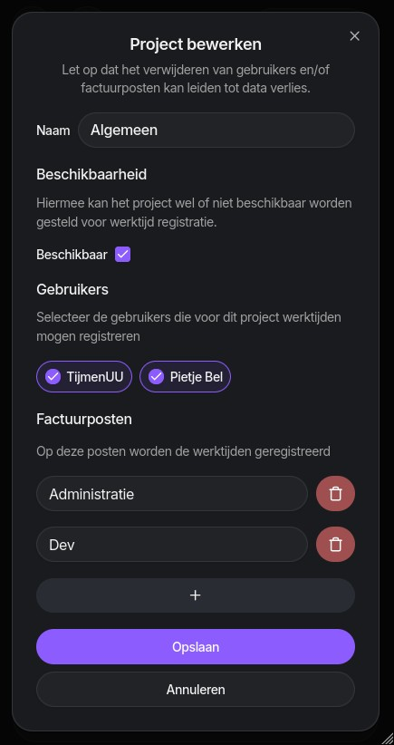

# Keepi

Keepi is a practice project first and foremost. It was developed to get some practice with:

- [Clean architecture](<https://en.wikipedia.org/wiki/Hexagonal_architecture_(software)>) also known as a plug-in architecture or as ports and adapters. The main goal of clean architecture in this repository was to get a clear understanding of its decoupling and its development overhead on a more realistic scale.
- [Vertical slicing](https://en.wikipedia.org/wiki/Vertical_slice)
  - [FastEndpoints](https://fast-endpoints.com/) is used to make this easier to implement in the JSON API
- [SPA YARP proxy](https://github.com/berhir/AspNetCore.SpaYarp) to use the backend before frontend pattern even during development
- The TypeScript [neverthrow library](https://github.com/supermacro/neverthrow) to avoid exceptions and use the result pattern instead
- [Shadcn](https://www.shadcn-vue.com/) to build a modern Vue frontend without reinventing the wheel

**Table of Contents**

- [Keepi](#keepi)
  - [What can keepi do?](#what-can-keepi-do)
  - [Repository structure](#repository-structure)
  - [Development](#development)
    - [Required software](#required-software)
    - [Optional software](#optional-software)
    - [Database migrations](#database-migrations)
    - [HTTPS certificate not trusted on Linux](#https-certificate-not-trusted-on-linux)
    - [EF Core exceptions](#ef-core-exceptions)
    - [Running Keepi Locally](#running-keepi-locally)
      - [Secrets](#secrets)
      - [Creating the database](#creating-the-database)
      - [Telemetry (logging, traces and metrics)](#telemetry-logging-traces-and-metrics)
      - [Starting Keepi](#starting-keepi)

## What can keepi do?

Keepi allows users to track spent time on user defined invoice items through a customizable matrix input for each week of a year. Invoice items are defined by administrator users who keep track of these through projects. Users can be assigned/unassigned from projects and projects can be enabled or disabled by the administrators. Finally, administrators can export spent time of all users over a specified period to a comma separated values (CSV) file.

In order to improve the user experience of the time tracking matrix input it can be customized with colors and/or custom ordering. This enables users to make it easier to highlight important invoice items and put most often used invoice items at the top.

Whilst the code is written in US English the localization of the application GUI is currently Dutch only. See below how Keepi looks in practice!


_Matrix input_

```csv
Gebruiker;Datum;Project;Post;Minuten;Opmerking
TijmenUU;26-01-2026;Algemeen;Dev;480;
TijmenUU;27-01-2026;Algemeen;Dev;360;
TijmenUU;27-01-2026;Algemeen;Administratie;120;
TijmenUU;28-01-2026;Algemeen;Dev;240;
TijmenUU;28-01-2026;Project H;Prototype H;240;
TijmenUU;29-01-2026;Algemeen;Dev;480;
TijmenUU;30-01-2026;Algemeen;Dev;420;
TijmenUU;30-01-2026;Algemeen;Administratie;60;
```

_Example CSV export output of the entries shown before_


_User customization options_


_Project administration_


_User administration_


_Dark and bright theme support_

  
_Responsive design_

## Repository structure

This repository roughly follows the [.NET example](https://devblogs.microsoft.com/ise/next-level-clean-architecture-boilerplate/) of clean architecture. Key to the concept of clean architecture is that dependencies flow inward and any implementation details are provided through so-called plug-ins, also known as adapters. In practice this means that the `src/Keepi.Core` project represents the "center" towards which all projects "point" in terms of dependency. A project such as the `src/Keepi.Infrastructure.Data` provides a persistence plug-in to the core by implementing the persistence related interfaces declared by the core, also known as ports.

The following (non-testing) projects are part of this repository, followed by a short description:

| Name                      | Description                                                                                                                                         |
| ------------------------- | --------------------------------------------------------------------------------------------------------------------------------------------------- |
| Keepi.Core                | The project containing all business logic without concerning itself with the exact implementation of input and output.                              |
| Keepi.Infrastructure.Data | A persistence layer implemented through EF Core and Sqlite3.                                                                                        |
| Keepi.Api                 | A JSON API serving as an input output wrapper around Keepi.Core                                                                                     |
| Keepi.Vue                 | A Vue 3 web application which uses the Keepi.Api provided HTTP endpoints to allow the user to interact with the business logic of Keepi.Core        |
| Keepi.Web                 | An ASP.Net Core project that combines the JSON API of Keepi.Api and the web client of Keepi.Vue to create a so called backend before frontend setup |

## Development

### Required software

- [bun](https://bun.sh/)
- [.NET 10 SDK](https://dotnet.microsoft.com/en-us/download/dotnet/10.0) including the ASP.Net runtime

Any other NPM + NodeJS compatible software can be used, just know that the `bun` calls in [Keepi.Web](src/Keepi.Web/Keepi.Web.csproj) must be replaced and/or an alias must be configured.

### Optional software

- [Csharpier](https://csharpier.com/)
- [SQLite3](https://sqlite.org/)

### Database migrations

Due to the use of Sqlite3 as the database there is limited support for migrations with EF Core. To avoid the hassle of these limitations the schema and the database are simply deleted and recreated, this obviously loses all of your data so beware:

```bash
# Remove the database and the EF core schema files
rm src/Keepi.Web/keepi.db
rm -r src/Keepi.Infrastructure.Data/Migrations/

# Regenerate the EF core schema files
dotnet ef migrations add 'InitialCreate' -p 'src/Keepi.Infrastructure.Data' -s 'src/Keepi.Web'

# Re-create the database
dotnet ef database update -p 'src/Keepi.Infrastructure.Data' -s 'src/Keepi.Web'
# On Linux there seems to be a bug where dotnet-ef generates a bogus directory, remove it
rm -r src/Keepi.Web/bin\\Debug
```

### HTTPS certificate not trusted on Linux

The combination of Linux and Firefox seems to work after using [this third party tool](https://github.com/dotnet/aspnetcore/issues/32842#issuecomment-2206905474):

```bash
dotnet tool update -g linux-dev-certs
dotnet linux-dev-certs install
```

### EF Core exceptions

By default the EF core exceptions are not exactly developer friendly, hence a third party strongly typed exceptions [package](https://github.com/Giorgi/EntityFramework.Exceptions) is used to make it easier to implement specific exception behaviour.

### Running Keepi Locally

This section helps setting up a local development environment for Keepi. Subsections below are meant to be followed in order from top to bottom. All bash commands below assume you have a terminal session open in the repository root.

#### Secrets

This project uses [GitHub OAuth app](https://docs.github.com/en/apps/oauth-apps/using-oauth-apps/installing-an-oauth-app-in-your-personal-account) authentication which requires a few secrets to be set up manually:

```bash
dotnet user-secrets set 'Authentication:GitHub:ClientId' 'YOUR_CLIENT_ID' --project 'src/Keepi.Web/'
dotnet user-secrets set 'Authentication:GitHub:ClientSecret' 'YOUR_CLIENT_SECRET' --project 'src/Keepi.Web/'
```

Next the email address of the first admin user must be configured as new users are normally added without administrative privileges:

```bash
dotnet user-secrets set 'Authentication:FirstAdminUserEmailAddress' 'EMAIL_ADDRESS_OF_ADMIN_ACCOUNT' --project 'src/Keepi.Web/'
```

Note that this email address must have been used to create the GitHub account with which you plan to log in and that this will only work when there are no administrator users already registered.

#### Creating the database

```bash
dotnet ef database update -p 'src/Keepi.Infrastructure.Data' -s 'src/Keepi.Web'
# On Linux there seems to be a bug where dotnet-ef generates a bogus directory, remove it
rm -r src/Keepi.Web/bin\\Debug
```

#### Telemetry (logging, traces and metrics)

This project uses Open Telemetry. Locally you can **optionally** use this by running the Aspire dashboard standalone:

```bash
docker run --rm -it -d \
    -p 18888:18888 \
    -p 4317:18889 \
    --name aspire-dashboard \
    mcr.microsoft.com/dotnet/aspire-dashboard:latest
```

Once the container is running, use the `docker logs` functionality or similar to find the API token:

```bash
user@DESKTOP$~ docker logs 413946f9acdf
...
info: Aspire.Dashboard.DashboardWebApplication[0]
      Login to the dashboard at http://localhost:18888/login?t=f9ed81434d7ec8903db5fb34b1be12e7 . The URL may need changes depending on how network access to the container is configured.
...
```

#### Starting Keepi

Now that all prerequisites have been tackled the actual Keepi web application can be launched. For debug builds:

```bash
dotnet run --project src/Keepi.Web
```

or for a release build:

```bash
dotnet run --project src/Keepi.Web -c Release
```

Note that debug builds use the YARP reverse proxy to forward requests to the Vite development server. Using the Vite development server enables useful features such as hot module replacement (HMR) and source mapping to make debugging easier.
